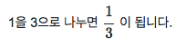
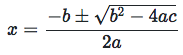

# LATEX-mathjax-cheatsheet

* mathjax : 자신의 웹사이트나 블로그에서 LATEX를 사용하는 가장 쉬운 방법.


## 시작하기

### import

* 다음 코드를 html에 추가하는 것으로 쉽게 시작할 수 있습니다.

```html
<script src='https://cdnjs.cloudflare.com/ajax/libs/mathjax/2.7.4/MathJax.js?config=TeX-MML-AM_CHTML' async></script>
```

* 참고: https://www.mathjax.org/#gettingstarted

### css

* css는 쓸데없이 건드리지 말고 자동으로 링크되는 것을 사용하는 편이 무난합니다.
* 다만, 텍스트와 수식을 한 줄에서 표현하고 싶다면 다음을 css에 추가해주는 방법을 고려할 수 있습니다.

```css
.MJXc-display {
    display: inline-block
}
```

## 분수의 표현

분수는 두 가지 방법으로 표현할 수 있습니다.

* `\frac{분자}{분모}`
* `{ 분자 \over 분모 }`

### \frac

* 다음과 같이 html을 작성하면 아래와 같이 나옵니다.

```tex
<p> 1을 3으로 나누면 $$ \frac{1}{3} $$ 이 됩니다. </p>
```



* 사실 `{ }`는 가독성과 범위 구분을 위해 추가한 것이며, 한 글자라면 `{  }`을 사용하지 않아도 상관없습니다.

```latex
<p> 1을 3으로 나누면 $$ \frac13 $$ 이 됩니다. </p>
```


* 하지만 `\frac{1}{3}`이 `\frac13`보다 가독성이 좋으므로 가급적이면 중괄호를 쓰는 쪽이 바람직합니다.

* 다음은 2차 방정식의 해를 표현한 것입니다.

```tex
$$x=\frac{-b\pm\sqrt{b^2-4ac}}{2a} $$
```



* 공백은 완전히 무시되므로, 읽기 편하게 스페이스를 넣어주면 좋습니다.

```tex
$$x = \frac{ -b \pm \sqrt{ b^2 - 4ac } }{ 2a } $$
```


* 중괄호로 확실히 구분해주기만 한다면 개행도 얼마든지 해도 상관 없습니다.

```tex
$$
x = \frac
    { -b \pm \sqrt{ b^2 - 4ac } }
    { 2a }
$$
```


### \over

* `\over`는 `\frac`과 비슷하지만 사용법이 약간 다릅니다.

```latex
<p> 1을 3으로 나누면 $$ 1 \over 3 $$ 이 됩니다. </p>
```


* 2차 방정식의 해를 `\over`로 표현하자면 다음과 같을 것입니다.

```tex
$$ x = { -b \pm \sqrt{ b^2 - 4ac } \over 2a } $$
```


* 물론 가독성을 위해 개행을 적당해 사용하는 것도 좋은 방법입니다.

```tex
$$
x =
{
    -b \pm \sqrt{ b^2 - 4ac }
    \over
    2a
}
$$
```


<script src='https://cdnjs.cloudflare.com/ajax/libs/mathjax/2.7.4/MathJax.js?config=TeX-MML-AM_CHTML' async></script>


<style>
.MJXc-display {
    display: inline-block
}
</style>
